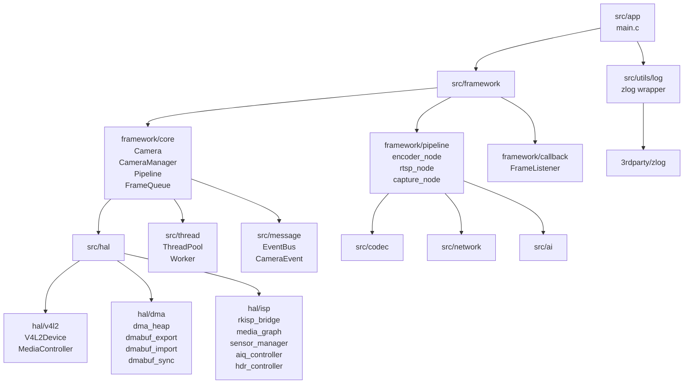
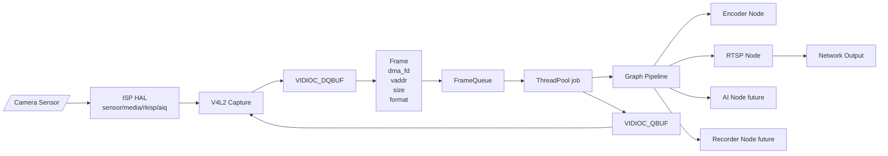
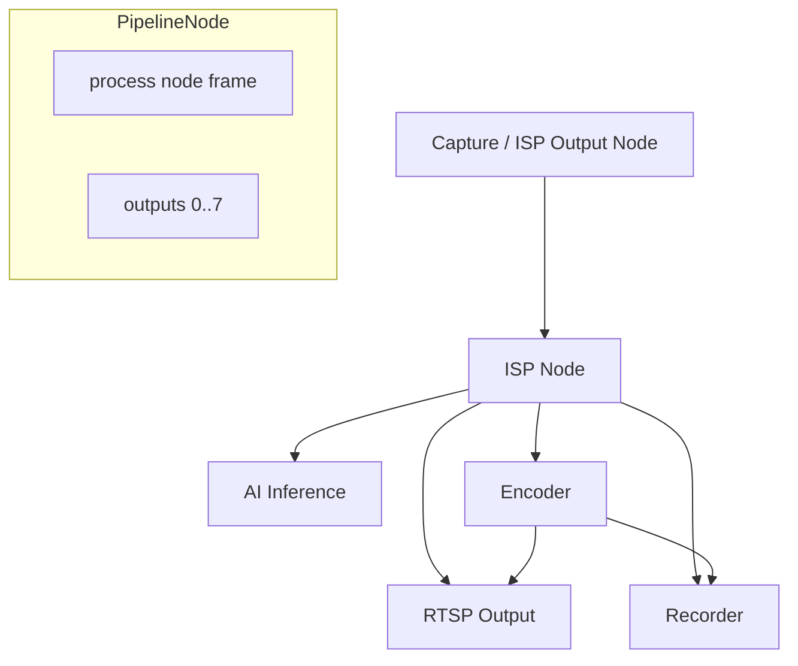
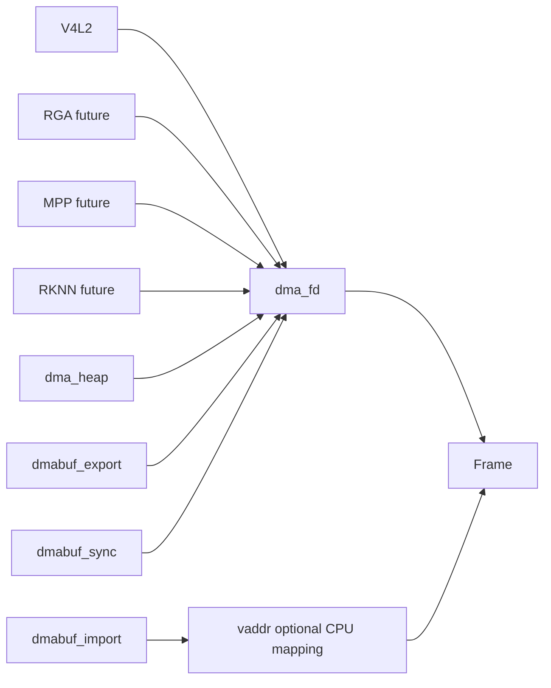
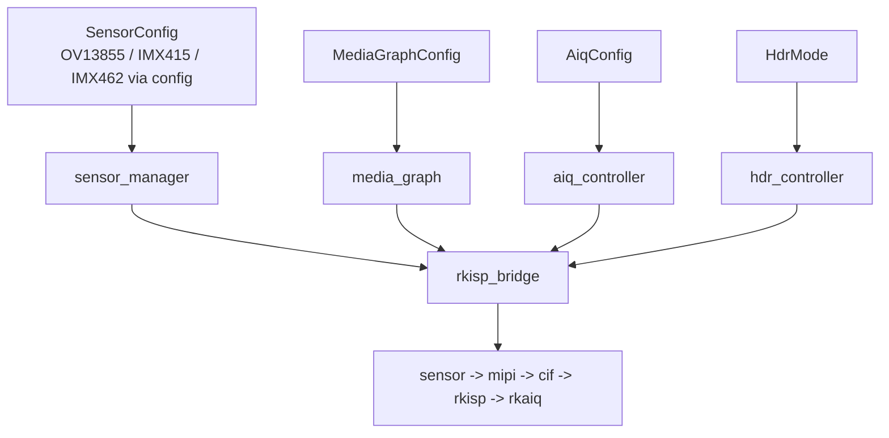
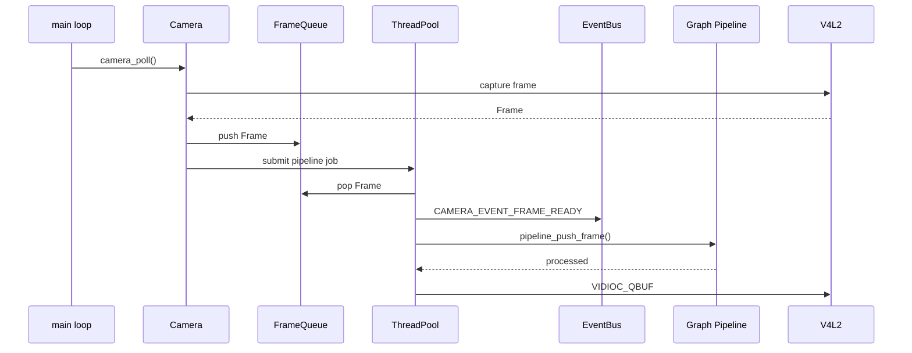
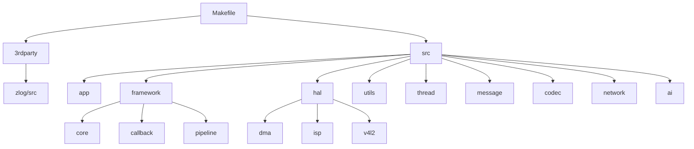

# Camera Framework Architecture

Date: 2026-05-30

This document uses Mermaid diagrams. Markdown viewers with Mermaid support can render the architecture diagrams directly.

## 1. Layered Architecture



## 2. Runtime Data Flow



## 3. Graph Pipeline



Pipeline nodes use:

```c
PipelineNode *outputs[PIPELINE_MAX_OUTPUTS];
int output_num;
```

`pipeline_add_output()` connects nodes. Traversal uses a visited set so shared nodes are not started, stopped, processed, or destroyed more than once per traversal.

## 4. Frame And DMA-BUF Model



Current `Frame` contract:

```c
typedef struct {
    int dma_fd;
    void *vaddr;
    size_t size;
    int width;
    int height;
    uint32_t pixfmt;
    uint64_t timestamp;
    int index;
} Frame;
```

The current V4L2 implementation still uses MMAP, so `dma_fd` is `-1` and `vaddr` points to the mapped V4L2 buffer. The HAL is prepared for shared fd pipelines.

## 5. ISP HAL



Sensor-specific values belong in `SensorConfig` and `MediaGraphConfig`; framework code should not change when adding a new sensor model.

## 6. Thread And Event Model



Events currently modeled:

```text
CAMERA_EVENT_FRAME_READY
CAMERA_EVENT_LOST
CAMERA_EVENT_STREAM_ON
CAMERA_EVENT_STREAM_OFF
```

## 7. Build-Time Module Tree


