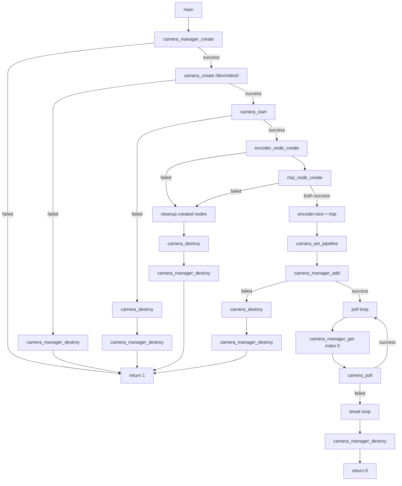
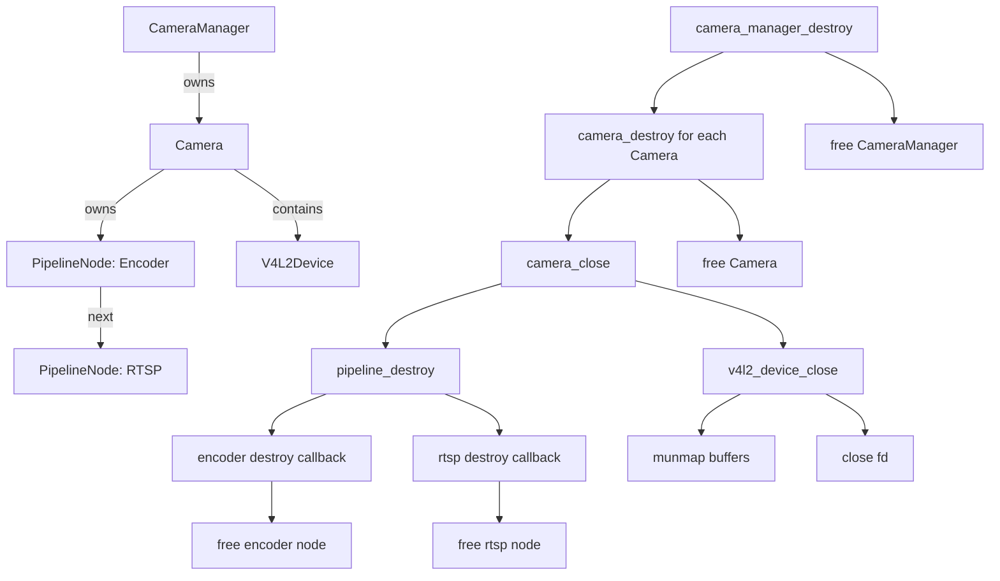
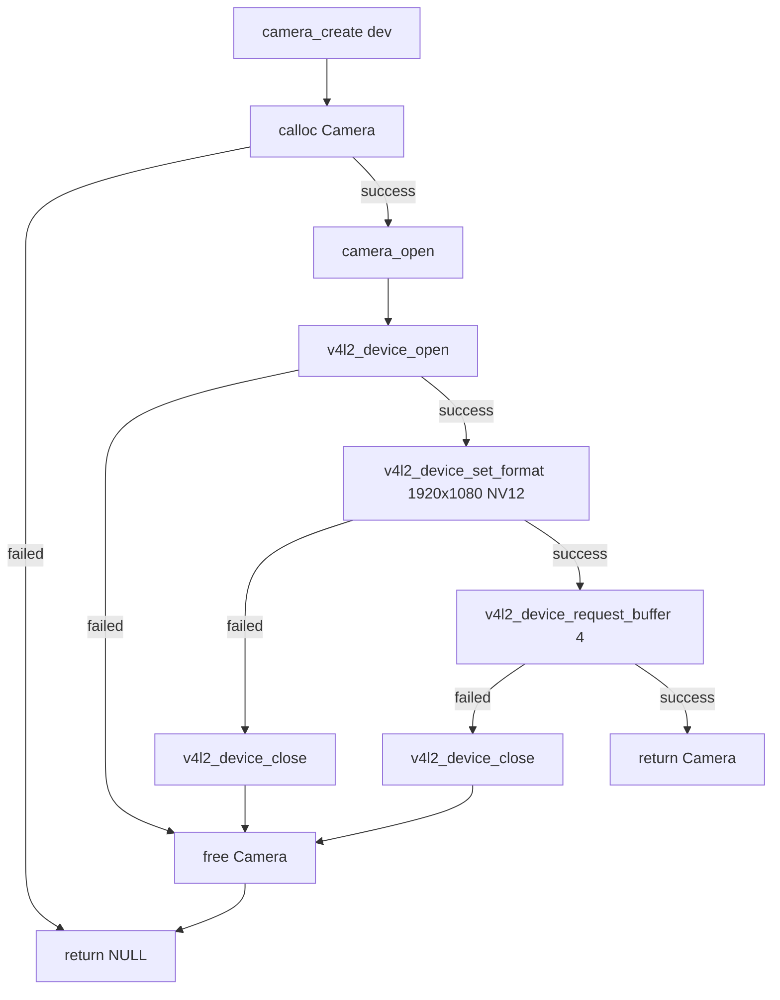
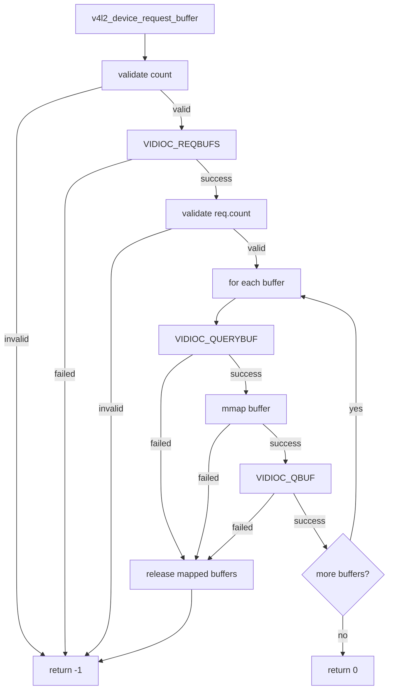
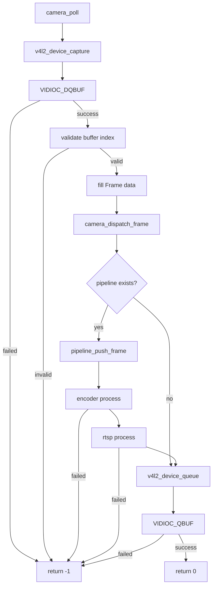
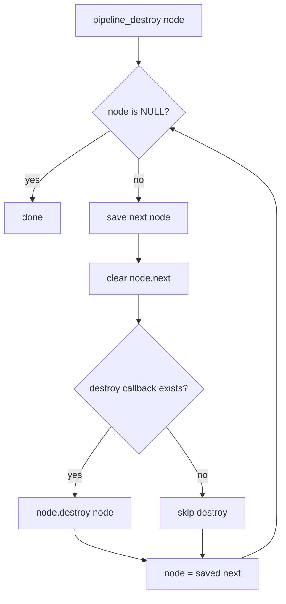
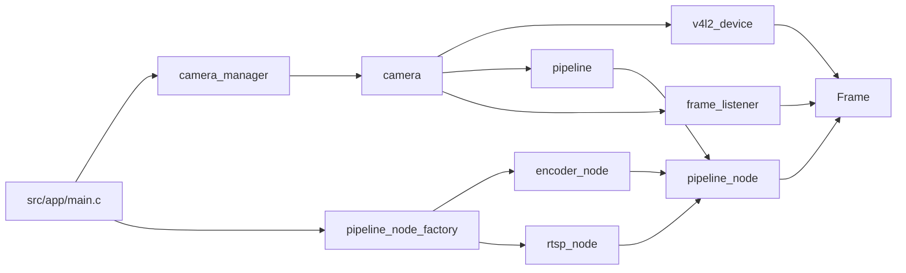

# Camera Framework Flowcharts

Date: 2026-05-30

This document uses Mermaid diagrams. Markdown viewers that support Mermaid can render these flowcharts directly.

## 1. Application Startup Flow

## 2. Ownership And Lifecycle

## 3. Camera Creation Flow

## 4. V4L2 Buffer Setup Flow

## 5. Frame Poll And Pipeline Flow

## 6. Pipeline Destroy Flow

## 7. Module Relationship Overview

